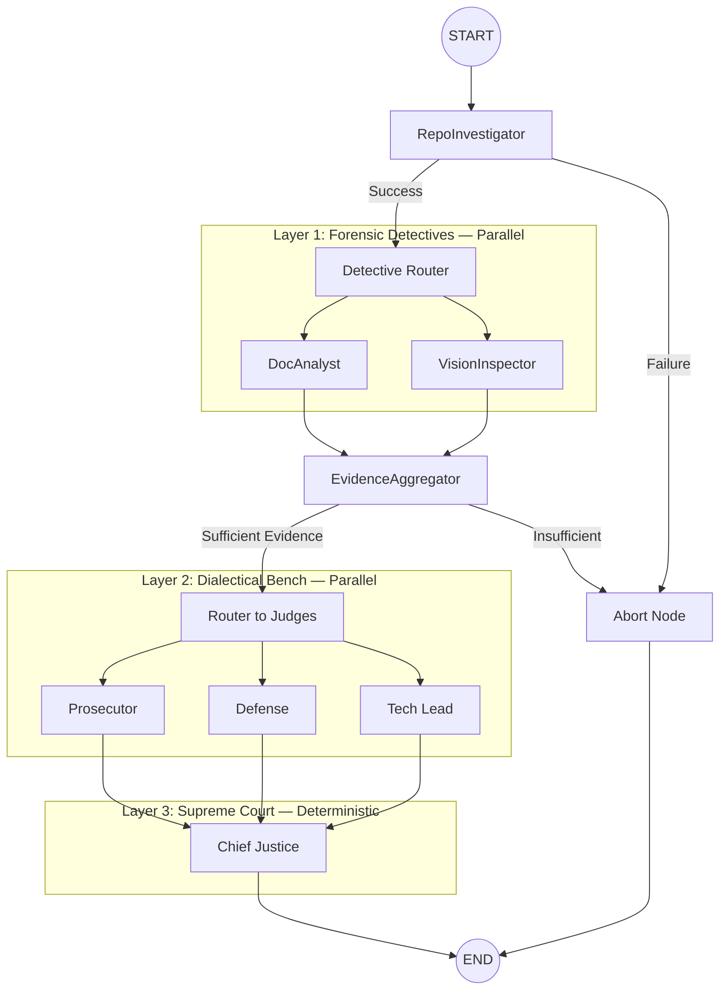

# Automaton Auditor — Complete Architecture Walkthrough

> **Purpose:** Client-ready deep dive into every component, tool, node, and data flow — from a GitHub URL input to a fully rendered Markdown audit report.

---

## 1. What Is the Automaton Auditor?

A **production-grade multi-agent swarm** that autonomously audits GitHub repositories and architectural PDF reports. It implements a **Digital Courtroom** metaphor:

- **Detectives** collect objective forensic evidence (code structure, git history, PDF content, diagrams)
- **Judges** interpret that evidence through three adversarial lenses (Prosecutor, Defense, Tech Lead)
- **Chief Justice** synthesizes a final verdict using deterministic Python rules — not LLM averaging

| Input                        | Process                          | Output                                                                                |
| :--------------------------- | :------------------------------- | :------------------------------------------------------------------------------------ |
| GitHub repo URL + PDF report | 3-layer hierarchical agent swarm | Structured Markdown audit report with scores, dissent summaries, and remediation plan |

---

## 2. Technology Stack

| Component     | Technology                                       | Purpose                                                       |
| :------------ | :----------------------------------------------- | :------------------------------------------------------------ |
| Orchestration | **LangGraph** `StateGraph`                       | Parallel fan-out/fan-in agent coordination                    |
| State         | **Pydantic** `BaseModel` + `TypedDict`           | Type-safe state with `operator.add` / `operator.ior` reducers |
| LLMs          | **Gemini 2.0 Flash** (default) or **OpenRouter** | Judge reasoning + concept depth checks                        |
| Vision        | **Gemini 2.0 Flash Vision**                      | Architectural diagram analysis                                |
| PDF Parsing   | **Docling** (primary) + **PyMuPDF** (fallback)   | Report text extraction + image extraction                     |
| AST Analysis  | Python's built-in `ast` module                   | Structural code verification (not regex)                      |
| Security      | `subprocess.run(shell=False)` + `tempfile`       | Sandboxed git operations                                      |
| Package Mgmt  | **uv**                                           | Fast, deterministic dependency management                     |
| Observability | **LangSmith**                                    | Full trace logging of every LLM call and graph step           |

---

## 3. Project Structure — File-by-File

```
automaton-auditor/
├── main.py                      # Entry point: loads rubric, builds initial state, invokes graph
├── audit.sh                     # Bash wrapper for CLI convenience
├── Makefile                     # `make audit URL=...` and `make local`
├── pyproject.toml               # Dependencies (langgraph, pydantic, pymupdf, etc.)
├── .env.example                 # API key configuration template
│
├── rubric/
│   └── week2_rubric.json        # The "Constitution" — 10 audit dimensions + synthesis rules
│
├── src/
│   ├── state.py                 # Pydantic models: Evidence, JudicialOpinion, AuditReport, AgentState
│   ├── graph.py                 # StateGraph wiring: nodes, edges, conditional routing
│   │
│   ├── nodes/
│   │   ├── detectives.py        # RepoInvestigator, DocAnalyst, VisionInspector, EvidenceAggregator
│   │   ├── judges.py            # Prosecutor, Defense, TechLead (factory pattern)
│   │   └── justice.py           # ChiefJusticeNode + deterministic rules + report serialization
│   │
│   └── tools/
│       ├── repo_tools.py        # AST visitors, git history, graph analysis, security scanning
│       ├── doc_tools.py         # PDF ingestion (Docling/fitz), concept depth, path cross-reference
│       ├── llm_tools.py         # LLM factory: Gemini or OpenRouter
│       └── safety.py            # URL validation, path sanitization, safe subprocess wrapper
│
├── reports/
│   ├── final_report.md          # Architecture narrative document
│   └── final_report.pdf         # PDF version for peer auditing
│
└── audit/
    ├── report_onself_generated/  # Self-audit output
    ├── report_onpeer_generated/  # Peer audit output
    └── report_bypeer_received/   # Received from peer's agent
```

---

## 4. Architecture — The Three Layers



### Key Architectural Patterns

| Pattern                 | Implementation                                                                                  | Why It Matters                                                                        |
| :---------------------- | :---------------------------------------------------------------------------------------------- | :------------------------------------------------------------------------------------ |
| **Fan-Out**             | `detective_router` → 2 parallel detectives; `router_to_judges` → 3 parallel judges              | Maximizes concurrency — detectives and judges don't block each other                  |
| **Fan-In**              | `EvidenceAggregator` collects all detective outputs; `ChiefJustice` collects all judge opinions | Synchronization barriers prevent premature advancement                                |
| **Conditional Routing** | `should_aggregate_or_abort()` + `after_aggregation()`                                           | Graceful degradation — if detectives fail, the system aborts instead of hallucinating |
| **State Reducers**      | `operator.ior` (dict merge) + `operator.add` (list append)                                      | Prevents parallel agents from overwriting each other's data                           |

---

## 5. Data Models — The State Contract

All data flowing through the graph is strictly typed via Pydantic. Defined in [state.py](file:///home/mistire/Projects/10Academy/course/week-2/automaton-auditor/src/state.py):

### `Evidence` (Detective Output)

| Field        | Type              | Description                                                   |
| :----------- | :---------------- | :------------------------------------------------------------ |
| `goal`       | `str`             | What was being investigated (e.g., `"git_forensic_analysis"`) |
| `found`      | `bool`            | Whether the artifact/pattern was found                        |
| `content`    | `Optional[str]`   | Extracted code snippet, text excerpt, or analysis             |
| `location`   | `str`             | File path, commit hash, or PDF section                        |
| `rationale`  | `str`             | Brief explanation of the finding                              |
| `confidence` | `float` (0.0–1.0) | Confidence in accuracy                                        |

### `JudicialOpinion` (Judge Output)

| Field            | Type                                           | Description                                            |
| :--------------- | :--------------------------------------------- | :----------------------------------------------------- |
| `judge`          | `Literal["Prosecutor", "Defense", "TechLead"]` | Which judge issued this opinion                        |
| `criterion_id`   | `str`                                          | Which rubric dimension (e.g., `"graph_orchestration"`) |
| `score`          | `int` (1–10)                                   | The judge's score on a standardized scale              |
| `argument`       | `str`                                          | Detailed philosophical/technical argument              |
| `cited_evidence` | `List[str]`                                    | Specific evidence goals/locations referenced           |

### `AuditReport` (Final Output)

| Field               | Type                    | Description                                     |
| :------------------ | :---------------------- | :---------------------------------------------- |
| `repo_url`          | `str`                   | The audited repository                          |
| `executive_summary` | `str`                   | Overall verdict with score                      |
| `overall_score`     | `float`                 | Percentage score (0–100)                        |
| `criteria`          | `List[CriterionResult]` | Per-dimension breakdown with all judge opinions |
| `remediation_plan`  | `str`                   | Actionable improvement instructions             |
| `timestamp`         | `str`                   | ISO timestamp of audit completion               |

### `AgentState` (Graph State)

The central shared state with **parallel-safe reducers**:

```python
class AgentState(BaseModel):
    repo_url: str
    pdf_path: Optional[str] = None
    local_repo_path: Optional[str] = None
    rubric_dimensions: List[Dict[str, Any]]                           # Loaded from rubric JSON
    evidences: Annotated[Dict[str, List[Evidence]], operator.ior]      # Dict merge (parallel-safe)
    opinions: Annotated[List[JudicialOpinion], operator.add]           # List append (parallel-safe)
    final_report: Optional[AuditReport] = None
    errors: Annotated[List[str], operator.add]                         # Error accumulation
```

> **Why Pydantic over plain dicts?** Strict runtime type validation prevents silent data corruption during parallel state merges. Every node respects the same structural contract.

---

## 6. Layer 1: Forensic Detective Tools (Deep Dive)

### 6.1 RepoInvestigator — [detectives.py](file:///home/mistire/Projects/10Academy/course/week-2/automaton-auditor/src/nodes/detectives.py)

The first node to execute. It:

1. **Clones the repo** into a sandboxed `tempfile` directory (or uses an existing local path)
2. **Dynamically dispatches** to specialized forensic tools based on the rubric's `target_artifact == "github_repo"` dimensions
3. **Discovers the PDF** in the repo's `reports/` folder and shares it via state

#### Specialized Forensic Tool Mapping

| Rubric Dimension                | Tool Function                   | What It Does                                                                                        |
| :------------------------------ | :------------------------------ | :-------------------------------------------------------------------------------------------------- |
| `git_forensic_analysis`         | `extract_git_history()`         | Runs `git log --oneline --reverse`, counts commits, checks for Setup→Tooling→Graph progression      |
| `state_management_rigor`        | `analyze_state_structure()`     | Uses `StateVisitor` (AST) to find `AgentState` class with `operator.add`/`operator.ior` reducers    |
| `graph_orchestration`           | `analyze_graph_orchestration()` | Uses `GraphVisitor` (AST) to find `StateGraph`, count edges, detect fan-out points                  |
| `safe_tool_engineering`         | `analyze_safe_tooling()`        | Uses `SecurityVisitor` (AST) to detect `os.system()` and `subprocess(shell=True)` violations        |
| `structured_output_enforcement` | `analyze_structured_output()`   | Scans for `.with_structured_output()` or `.bind_tools()` in judge nodes                             |
| `judicial_nuance`               | `analyze_judicial_nuance()`     | Extracts 3 persona prompts, measures word overlap (<50% = no collusion), verifies keyword alignment |
| `chief_justice_synthesis`       | `analyze_justice_synthesis()`   | Regex scans for "Rule of Security", "Rule of Hallucination", "Rule of Evidence" in justice.py       |
| _(fallback)_                    | `file_content_crawler()`        | Adaptive keyword search across repo files — used when no specialized tool exists                    |

#### AST Visitors (in [repo_tools.py](file:///home/mistire/Projects/10Academy/course/week-2/automaton-auditor/src/tools/repo_tools.py))

| Visitor           | Purpose                                                                                                     |
| :---------------- | :---------------------------------------------------------------------------------------------------------- |
| `StateVisitor`    | Finds `AgentState` class, verifies `Annotated[..., operator.add/ior]` reducers                              |
| `SecurityVisitor` | Detects `os.system()` calls, `subprocess.run(shell=True)`, and rewards `tempfile` usage                     |
| `GraphVisitor`    | Finds `StateGraph()` instantiation, extracts all `add_edge()`/`add_node()` calls, identifies fan-out points |

### 6.2 DocAnalyst — PDF Intelligence

Analyzes the architectural PDF report:

| Task                  | Method                                             | Details                                                                                                                                                                                    |
| :-------------------- | :------------------------------------------------- | :----------------------------------------------------------------------------------------------------------------------------------------------------------------------------------------- |
| **PDF Ingestion**     | `ingest_pdf()`                                     | Uses **Docling** (markdown conversion) with **PyMuPDF** fallback                                                                                                                           |
| **Report Accuracy**   | `extract_file_paths()` + `cross_reference_paths()` | Regex extracts all `src/...` paths from PDF, then cross-references against actual repo structure → produces Verified vs. Hallucinated lists                                                |
| **Theoretical Depth** | `check_concept_depth()`                            | For each concept (Dialectical Synthesis, Fan-In, Metacognition, State Synchronization): extracts 1200-char context windows, sends to LLM asking "is this substantive or keyword dropping?" |

### 6.3 VisionInspector — Multimodal Analysis

| Step               | Details                                                                                                     |
| :----------------- | :---------------------------------------------------------------------------------------------------------- |
| 1. Extract images  | `extract_images_from_pdf()` via PyMuPDF → saves to temp directory                                           |
| 2. Vision analysis | Sends images to **Gemini 2.0 Flash Vision** with rubric-specific prompts                                    |
| 3. Output          | Classifies diagrams (StateGraph? Sequence? Generic flowchart?) and checks for parallel branch visualization |

### 6.4 EvidenceAggregator — Synchronization Node

The fan-in synchronization point that:

1. **Audits completeness** — checks which detective sources (repo, doc, vision) are present vs. missing
2. **Computes quality metrics** — average confidence score across all evidence items
3. **Gates the pipeline** — decides if enough evidence exists to proceed to judges

---

## 7. Layer 2: The Judicial Bench (Deep Dive)

Defined in [judges.py](file:///home/mistire/Projects/10Academy/course/week-2/automaton-auditor/src/nodes/judges.py) via a **factory pattern** — `create_judge_node(persona, name)` generates three distinct judge nodes.

### The Three Personas

| Judge          | Philosophy                            | Focus                                                    | Key Phrases                                                                                           |
| :------------- | :------------------------------------ | :------------------------------------------------------- | :---------------------------------------------------------------------------------------------------- |
| **Prosecutor** | _"Trust No One. Assume Vibe Coding."_ | Gaps, security flaws, laziness, orchestration fraud      | Charges: "Orchestration Fraud" (1/10), "Hallucination Liability" (2/10), "Security Negligence" (2/10) |
| **Defense**    | _"Reward Effort and Intent."_         | Creative workarounds, iterative effort, intent           | Seeks: "Iterative Excellence" (9-10/10), "Deep Code Comprehension"                                    |
| **Tech Lead**  | _"Does it actually work?"_            | Architectural soundness, maintainability, technical debt | Evaluates: "Architectural Soundness" (10/10) vs. "Technical Debt" (3/10). Acts as tie-breaker         |

### How Each Judge Works

1. **LLM Initialization**: `get_llm().with_structured_output(JudicialOpinion)` — enforces Pydantic schema
2. **Evidence Context Building**: Flattens all detective evidence into a readable `✅ found / ❌ missing` format
3. **Per-Dimension Deliberation**: For each of the 10 rubric dimensions, sends a prompt combining:
   - The judge's persona philosophy
   - The specific rubric dimension (ID, name, forensic instruction, success/failure patterns)
   - All collected forensic evidence
4. **Retry Logic**: 3 attempts per dimension — if structured output fails, retries before creating a fallback `score=0` opinion
5. **Output**: Returns a list of `JudicialOpinion` objects added to state via `operator.add` reducer

---

## 8. Layer 3: The Supreme Court (Deep Dive)

The [ChiefJusticeNode](file:///home/mistire/Projects/10Academy/course/week-2/automaton-auditor/src/nodes/justice.py) is **entirely deterministic Python** — no LLM calls. It implements a **Judicial Validation Overlay**:

### Conflict Resolution Rules

| Rule                      | Trigger                                                                                                          | Action                                                     |
| :------------------------ | :--------------------------------------------------------------------------------------------------------------- | :--------------------------------------------------------- |
| **Rule of Security**      | `safe_tool_engineering` evidence is `found=False` OR Prosecutor mentions "security violation/failure/negligence" | **Hard cap at 2/10** — overrides all effort points         |
| **Rule of Hallucination** | `path_hallucinations_detected` evidence is `found=True`                                                          | **Hard cap at 2/10** for `report_accuracy` dimension       |
| **Rule of Evidence**      | Judges failed to cite any specific forensic evidence AND average score > 5                                       | **Cap at 4/10** — penalizes unsupported claims             |
| **Dissent Requirement**   | Score variance across 3 judges exceeds 2 points                                                                  | Generates explicit dissent summary explaining the conflict |

### Scoring Algorithm

```
For each rubric dimension:
  1. Average the 3 judges' raw LLM scores → avg_llm_score
  2. Apply deterministic override rules (security, hallucination, evidence)
  3. final_score = capped value or avg_llm_score
  4. Accumulate into total_raw_points / total_possible_points (10 per dimension)

Overall % = (total_raw_points / total_possible_points) × 100
```

### Report Generation

The final `AuditReport` is serialized to a Markdown file in `audit/report_on{self|peer}_generated/`:

```
# ⚖️ Audit Report: <repo_url>
## Executive Summary
## Criterion Breakdown
  ### <Dimension Name>
  **Final Score:** X/10
  > [!IMPORTANT] **Judicial Dissent:** ...
  | Judge | Score | Argument |
  | Prosecutor | 3 | ... |
  | Defense | 8 | ... |
  | TechLead | 5 | ... |
## Remediation Plan
```

---

## 9. The Rubric — The Agent's Constitution

The [week2_rubric.json](file:///home/mistire/Projects/10Academy/course/week-2/automaton-auditor/rubric/week2_rubric.json) defines **10 audit dimensions** — the binding law for the agent swarm:

| #   | Dimension                     | Target Artifact | What's Checked                                                                          |
| :-- | :---------------------------- | :-------------- | :-------------------------------------------------------------------------------------- |
| 1   | Git Forensic Analysis         | Repo            | Commit count, progression story (Setup→Tooling→Graph)                                   |
| 2   | State Management Rigor        | Repo            | Pydantic/TypedDict with `operator.add`/`operator.ior` reducers                          |
| 3   | Graph Orchestration           | Repo            | `StateGraph` with parallel fan-out/fan-in, conditional edges                            |
| 4   | Safe Tool Engineering         | Repo            | `tempfile` sandboxing, no `os.system()`, proper error handling                          |
| 5   | Structured Output Enforcement | Repo            | `.with_structured_output()` on judge LLM calls, retry logic                             |
| 6   | Judicial Nuance & Dialectics  | Repo            | 3 distinct personas with <50% prompt overlap                                            |
| 7   | Chief Justice Synthesis       | Repo            | Deterministic Python rules (security override, fact supremacy)                          |
| 8   | Theoretical Depth             | PDF             | Substantive explanation of Dialectical Synthesis, Fan-In/Out, Metacognition, State Sync |
| 9   | Report Accuracy               | PDF             | Cross-reference: file paths in report vs. actual repo structure                         |
| 10  | Architectural Diagram         | PDF Images      | Multimodal analysis of diagram accuracy (parallel branches visible?)                    |

Plus **5 synthesis rules**: security_override, fact_supremacy, functionality_weight, dissent_requirement, variance_re_evaluation.

---

## 10. Complete Tool Inventory Per Node

Every graph node and the exact tools/functions/libraries it calls:

### Node: `repo_investigator` → [detectives.py#L10-L79](file:///home/mistire/Projects/10Academy/course/week-2/automaton-auditor/src/nodes/detectives.py#L10-L79)

| Step | Tool/Function Called                                        | Source File                                                                                                                          | What Happens                                                                                                    |
| :--- | :---------------------------------------------------------- | :----------------------------------------------------------------------------------------------------------------------------------- | :-------------------------------------------------------------------------------------------------------------- |
| 1    | `safety.is_valid_github_url()`                              | [safety.py#L6](file:///home/mistire/Projects/10Academy/course/week-2/automaton-auditor/src/tools/safety.py#L6)                       | Validates the GitHub URL with regex (HTTPS + SSH patterns)                                                      |
| 2    | `tempfile.mkdtemp()`                                        | Python stdlib                                                                                                                        | Creates an isolated temp directory `auditor_XXXXX`                                                              |
| 3    | `safety.run_safe_command(["git", "clone", url, dir])`       | [safety.py#L32](file:///home/mistire/Projects/10Academy/course/week-2/automaton-auditor/src/tools/safety.py#L32)                     | Runs `subprocess.run(shell=False)` with error capture                                                           |
| 4    | `safety.parse_git_error()`                                  | [safety.py#L63](file:///home/mistire/Projects/10Academy/course/week-2/automaton-auditor/src/tools/safety.py#L63)                     | If clone fails: classifies as 404/401/NETWORK_ERROR                                                             |
| 5    | `repo_tools.extract_git_history()`                          | [repo_tools.py#L33](file:///home/mistire/Projects/10Academy/course/week-2/automaton-auditor/src/tools/repo_tools.py#L33)             | Runs `git log --oneline --reverse`, counts commits, checks Setup→Tooling→Graph keywords                         |
| 6    | `repo_tools.analyze_state_structure()` → `StateVisitor`     | [repo_tools.py#L84-L161](file:///home/mistire/Projects/10Academy/course/week-2/automaton-auditor/src/tools/repo_tools.py#L84-L161)   | AST parses `src/state.py`, walks class defs to find `AgentState`, checks for `Annotated[..., operator.add/ior]` |
| 7    | `repo_tools.analyze_graph_orchestration()` → `GraphVisitor` | [repo_tools.py#L196-L247](file:///home/mistire/Projects/10Academy/course/week-2/automaton-auditor/src/tools/repo_tools.py#L196-L247) | AST parses `src/graph.py`, detects `StateGraph()`, extracts `add_edge()` pairs, counts fan-out points           |
| 8    | `repo_tools.analyze_safe_tooling()` → `SecurityVisitor`     | [repo_tools.py#L108-L190](file:///home/mistire/Projects/10Academy/course/week-2/automaton-auditor/src/tools/repo_tools.py#L108-L190) | AST scans all `src/tools/*.py` for `os.system()` + `subprocess(shell=True)` violations                          |
| 9    | `repo_tools.analyze_structured_output()`                    | [repo_tools.py#L249-L271](file:///home/mistire/Projects/10Academy/course/week-2/automaton-auditor/src/tools/repo_tools.py#L249-L271) | String scans `src/nodes/judges.py` for `.with_structured_output()` or `.bind_tools()`                           |
| 10   | `repo_tools.analyze_judicial_nuance()`                      | [repo_tools.py#L274-L329](file:///home/mistire/Projects/10Academy/course/week-2/automaton-auditor/src/tools/repo_tools.py#L274-L329) | Regex extracts 3 persona prompts, computes word-set overlap, verifies adversarial/forgiving/pragmatic keywords  |
| 11   | `repo_tools.analyze_justice_synthesis()`                    | [repo_tools.py#L332-L361](file:///home/mistire/Projects/10Academy/course/week-2/automaton-auditor/src/tools/repo_tools.py#L332-L361) | Regex scans `src/nodes/justice.py` for named rules (Security, Hallucination, Evidence)                          |
| 12   | `repo_tools.file_content_crawler()` _(fallback)_            | [repo_tools.py#L363-L398](file:///home/mistire/Projects/10Academy/course/week-2/automaton-auditor/src/tools/repo_tools.py#L363-L398) | Walks `src/`, `tools/`, `nodes/` directories, keyword searches `.py`/`.md`/`.json` files                        |
| 13   | PDF discovery                                               | inline in node                                                                                                                       | Scans `<repo>/reports/` for `.pdf` files, shares path via state                                                 |

**State output:** `{"evidences": {"repo": [7+ Evidence objects]}, "local_repo_path": "...", "pdf_path": "..."}`

---

### Node: `detective_router` → [graph.py#L77](file:///home/mistire/Projects/10Academy/course/week-2/automaton-auditor/src/graph.py#L77)

- **Tool:** `lambda x: x` — a pass-through identity function
- **Purpose:** LangGraph requires a node to fan-out from; this is a no-op that acts as the branching point for parallel detectives
- **State output:** Unchanged — passes state directly to `doc_analyst` and `vision_inspector` simultaneously

---

### Node: `doc_analyst` → [detectives.py#L83-L150](file:///home/mistire/Projects/10Academy/course/week-2/automaton-auditor/src/nodes/detectives.py#L83-L150)

| Step | Tool/Function Called                           | Source File                                                                                                                        | What Happens                                                                                                                                                                                                                                                     |
| :--- | :--------------------------------------------- | :--------------------------------------------------------------------------------------------------------------------------------- | :--------------------------------------------------------------------------------------------------------------------------------------------------------------------------------------------------------------------------------------------------------------- |
| 1    | `doc_tools.ingest_pdf()`                       | [doc_tools.py#L15-L41](file:///home/mistire/Projects/10Academy/course/week-2/automaton-auditor/src/tools/doc_tools.py#L15-L41)     | Tries **Docling** `DocumentConverter` → exports to markdown. Falls back to **PyMuPDF** `fitz.open()` → `page.get_text()`                                                                                                                                         |
| 2    | `doc_tools.extract_file_paths()`               | [doc_tools.py#L44-L54](file:///home/mistire/Projects/10Academy/course/week-2/automaton-auditor/src/tools/doc_tools.py#L44-L54)     | Regex: `r'(?:src\|reports\|audit\|...)/.+'` — extracts all project file paths from PDF text                                                                                                                                                                      |
| 3    | `doc_tools.cross_reference_paths()`            | [doc_tools.py#L148-L173](file:///home/mistire/Projects/10Academy/course/week-2/automaton-auditor/src/tools/doc_tools.py#L148-L173) | For each extracted path, checks `Path(repo_path / path).exists()` → builds Verified vs. Hallucinated lists                                                                                                                                                       |
| 4    | `doc_tools.check_concept_depth()` × 4 concepts | [doc_tools.py#L57-L107](file:///home/mistire/Projects/10Academy/course/week-2/automaton-auditor/src/tools/doc_tools.py#L57-L107)   | For each concept ("Dialectical Synthesis", "Fan-In", "Metacognition", "State Synchronization"): finds up to 3 mentions, extracts 1200-char context windows, sends to **Gemini LLM** with prompt asking "substantive or keyword dropping?" → parses JSON response |
| 5    | Adaptive fallback keyword search               | inline                                                                                                                             | For unknown dimensions: splits `forensic_instruction` into keywords, searches full PDF text                                                                                                                                                                      |

**LLMs used:** `get_llm(temperature=0.0)` — Gemini 2.0 Flash (for concept depth checks)  
**Libraries:** `docling.DocumentConverter`, `fitz` (PyMuPDF), `re`, `json`  
**State output:** `{"evidences": {"doc": [5-8 Evidence objects]}}`

---

### Node: `vision_inspector` → [detectives.py#L153-L201](file:///home/mistire/Projects/10Academy/course/week-2/automaton-auditor/src/nodes/detectives.py#L153-L201)

| Step | Tool/Function Called                                 | Source File                                                                                                                        | What Happens                                                                                                                            |
| :--- | :--------------------------------------------------- | :--------------------------------------------------------------------------------------------------------------------------------- | :-------------------------------------------------------------------------------------------------------------------------------------- |
| 1    | `doc_tools.extract_images_from_pdf()`                | [doc_tools.py#L110-L145](file:///home/mistire/Projects/10Academy/course/week-2/automaton-auditor/src/tools/doc_tools.py#L110-L145) | Uses **PyMuPDF** to iterate pages → `page.get_images()` → `doc.extract_image(xref)` → saves to temp dir                                 |
| 2    | `get_llm(model_id="google/gemini-2.0-flash:free")`   | [llm_tools.py#L5](file:///home/mistire/Projects/10Academy/course/week-2/automaton-auditor/src/tools/llm_tools.py#L5)               | Initializes **Gemini 2.0 Flash Vision** model                                                                                           |
| 3    | `base64.b64encode()` → `HumanMessage` with image_url | inline                                                                                                                             | Encodes each image as base64 data URI, wraps in a multimodal `HumanMessage`                                                             |
| 4    | `vision_llm.invoke([message])`                       | LangChain                                                                                                                          | Sends image + rubric-specific prompt to Gemini Vision asking: "Is this an accurate StateGraph diagram? Does it show parallel branches?" |

**LLMs used:** `google/gemini-2.0-flash:free` via OpenRouter (multimodal vision)  
**Libraries:** `fitz` (PyMuPDF), `base64`, `langchain_core.messages.HumanMessage`  
**State output:** `{"evidences": {"vision": [1-4 Evidence objects]}}`

---

### Node: `evidence_aggregator` → [detectives.py#L204-L244](file:///home/mistire/Projects/10Academy/course/week-2/automaton-auditor/src/nodes/detectives.py#L204-L244)

| Step | What Happens                                                               |
| :--- | :------------------------------------------------------------------------- |
| 1    | Checks which sources are present (`repo`, `doc`, `vision`) vs. missing     |
| 2    | Flattens all evidence items across sources                                 |
| 3    | Computes `avg_confidence = sum(e.confidence) / count`                      |
| 4    | Counts `found_count` / `total_count` forensic markers                      |
| 5    | Creates 2 meta-Evidence objects: `evidence_completeness` + `quality_audit` |

**Tools/LLMs used:** None — pure Python aggregation logic  
**Libraries:** None (just Python arithmetic)  
**State output:** `{"evidences": {"aggregation": [2 Evidence objects]}}`

---

### Node: `router_to_judges` → [graph.py#L95](file:///home/mistire/Projects/10Academy/course/week-2/automaton-auditor/src/graph.py#L95)

- **Tool:** `lambda x: x` — another pass-through fan-out node
- **Purpose:** Branches state to 3 judge nodes running in parallel

---

### Nodes: `prosecutor` / `defense` / `tech_lead` → [judges.py#L12-L107](file:///home/mistire/Projects/10Academy/course/week-2/automaton-auditor/src/nodes/judges.py#L12-L107)

All three are created by the factory `create_judge_node(persona, name)` — identical logic, different persona prompts:

| Step | Tool/Function Called                                                                      | What Happens                                                               |
| :--- | :---------------------------------------------------------------------------------------- | :------------------------------------------------------------------------- |
| 1    | `get_llm()`                                                                               | Gets default LLM (Gemini 2.0 Flash or OpenRouter)                          |
| 2    | `llm.with_structured_output(JudicialOpinion)`                                             | Wraps LLM to enforce Pydantic `JudicialOpinion` output schema              |
| 3    | Evidence flattening                                                                       | Iterates `state.evidences` → builds `✅ found / ❌ missing` text context   |
| 4    | **For each of 10 rubric dimensions:**                                                     |                                                                            |
| 4a   | Builds prompt with: persona + dimension details + success/failure patterns + all evidence |                                                                            |
| 4b   | `structured_llm.invoke(prompt)`                                                           | Sends to LLM, expects `JudicialOpinion` JSON back                          |
| 4c   | Retry loop (3 attempts)                                                                   | If structured output fails (malformed JSON), retries up to 3×              |
| 4d   | `JudicialOpinion(**opinion.model_dump())`                                                 | Reconstructs clean Pydantic object to avoid LangGraph serialization issues |
| 4e   | Fallback on total failure                                                                 | Creates `score=0` opinion with error message                               |

**LLMs used:** `get_llm()` → Gemini 2.0 Flash (with structured output enforcement)  
**Libraries:** `langchain_google_genai.ChatGoogleGenerativeAI`, `json`  
**State output:** `{"opinions": [10 JudicialOpinion objects]}` (per judge, 30 total across all 3)

---

### Node: `chief_justice` → [justice.py#L6-L102](file:///home/mistire/Projects/10Academy/course/week-2/automaton-auditor/src/nodes/justice.py#L6-L102)

| Step | What Happens                                                                                                                                                |
| :--- | :---------------------------------------------------------------------------------------------------------------------------------------------------------- |
| 1    | Groups opinions by `criterion_id` — matches each dimension's 3 judge opinions                                                                               |
| 2    | Computes `avg_llm_score = sum(scores) / 3` for each dimension                                                                                               |
| 3    | **Rule of Security**: Looks up `safe_tool_engineering` evidence + prosecutor's argument for "security violation" keywords → if triggered, hard caps at 2/10 |
| 4    | **Rule of Hallucination**: For `report_accuracy`, checks if `path_hallucinations_detected` evidence exists → if triggered, hard caps at 2/10                |
| 5    | **Rule of Evidence**: If no judges cited any evidence AND avg > 5.0, caps at 4/10                                                                           |
| 6    | **Dissent Detection**: Computes `variance = max(scores) - min(scores)` → if > 2, generates dissent summary                                                  |
| 7    | Builds `CriterionResult` per dimension (with opinions, dissent, remediation from TechLead's argument)                                                       |
| 8    | Computes `overall_percentage = (total_points / total_possible) × 100`                                                                                       |
| 9    | Constructs `AuditReport` Pydantic model                                                                                                                     |
| 10   | `save_report_to_file()` → serializes to Markdown in `audit/report_on{self\|peer}_generated/`                                                                |

**Tools/LLMs used:** **Zero LLM calls** — entirely deterministic Python logic  
**Libraries:** `datetime`, `os`  
**State output:** `{"final_report": AuditReport}`

---

### Node: `abort` → [graph.py#L50-L52](file:///home/mistire/Projects/10Academy/course/week-2/automaton-auditor/src/graph.py#L50-L52)

- **Tool:** None — returns error message
- **Purpose:** Terminal node when detectives fail or evidence is insufficient
- **State output:** `{"errors": ["ABORT: Insufficient evidence..."]}`

---

## 11. End-to-End: How Everything Works Together (Step by Step)

This is the complete lifecycle of data from the moment you type `make audit URL=...` to the final Markdown report being saved.

### Step 1: CLI Entry → `main.py`

The user runs one of:

```bash
make local              # → audit.sh → main.py --repo_url LOCAL_AUDIT_WORKSPACE --local_repo_path .
make audit URL=<url>    # → audit.sh → main.py --repo_url <url>
```

`main.py` does three things:

1. Loads `.env` for API keys (`GOOGLE_API_KEY`, `LLM_PROVIDER`, `LANGCHAIN_TRACING_V2`)
2. Reads `rubric/week2_rubric.json` → this is the **10 audit dimensions + 5 synthesis rules**
3. Builds the initial `AgentState` with empty containers:

```python
initial_state = {
    "repo_url": "https://github.com/user/repo",
    "pdf_path": "",
    "rubric_dimensions": [... 10 dimension dicts ...],
    "evidences": {},       # Empty dict for detective findings
    "opinions": [],        # Empty list for judge opinions
    "final_report": None,  # Will be filled by ChiefJustice
    "errors": []           # Will accumulate any errors
}
```

4. Calls `graph.invoke(initial_state)` — **this starts the entire swarm**

---

### Step 2: Graph Starts → `repo_investigator` Runs First

The `StateGraph` begins at `START` which points to `repo_investigator` (the only valid entry point). This node **must run first** because all other detectives depend on its output (the cloned repo path and discovered PDF path).

**What happens inside:**

- If a `local_repo_path` is provided (e.g., `make local`), it uses that directly
- Otherwise, `clone_repo(url)` validates the URL → creates a temp directory → runs `git clone` → returns the path
- It then loops through all 10 rubric dimensions, but **only processes the 7 that have `target_artifact: "github_repo"`**
- For each matching dimension, it dispatches to the corresponding specialized tool via the `REPOMAPPING` dictionary
- Each tool returns one or more `Evidence` objects with `found`, `content`, `rationale`, `confidence`
- Finally, it discovers the PDF by scanning `<repo>/reports/*.pdf`

**Data transformation:**

```
Input:  AgentState(repo_url="...", evidences={}, ...)
Output: {"evidences": {"repo": [Evidence, Evidence, ...]},
         "local_repo_path": "/tmp/auditor_abc123",
         "pdf_path": "/tmp/auditor_abc123/reports/final_report.pdf"}
```

The `evidences` field uses `operator.ior` (dict merge), so `{"repo": [...]}` is **merged** into the existing empty dict.

---

### Step 3: Conditional Edge → Should We Continue?

`should_aggregate_or_abort(state)` checks:

- If `evidences` is empty AND `errors` exists → `"abort"` → goes to abort node → END
- If any evidence exists → `"aggregate"` → goes to `detective_router`

This is the **first safety gate** — if the repo can't be cloned, the system doesn't hallucinate evidence.

---

### Step 4: `detective_router` → Parallel Fan-Out to DocAnalyst + VisionInspector

The router is a `lambda x: x` pass-through. LangGraph sees that it has edges to **both** `doc_analyst` **and** `vision_inspector`, so it runs them **concurrently** in separate threads.

At this point, the state contains:

- `repo_url`, `local_repo_path`, `pdf_path` — all set by repo_investigator
- `evidences: {"repo": [...]}` — from repo_investigator
- `rubric_dimensions: [... 10 dimensions ...]` — from initial state

Both parallel detectives receive this **same state snapshot**.

---

### Step 5: `doc_analyst` Runs (Parallel Branch A)

1. Reads `state.pdf_path` — if no PDF was found, returns a single `found=False` evidence and exits
2. Ingests PDF via Docling/PyMuPDF → gets full text as markdown
3. Loops through dimensions where `target_artifact == "pdf_report"` (2 dimensions):
   - **`report_accuracy`**: Extracts all file paths from PDF text, cross-references against actual repo → builds Verified vs. Hallucinated lists
   - **`theoretical_depth`**: For each of 4 concepts, finds mentions → extracts context windows → sends to LLM for depth assessment
4. Returns `{"evidences": {"doc": [...Evidence objects]}}`

---

### Step 6: `vision_inspector` Runs (Parallel Branch B)

1. Reads `state.pdf_path` — if no PDF, returns `found=False`
2. Extracts images from PDF using PyMuPDF (up to 2 images for efficiency)
3. Loops through dimensions where `target_artifact == "pdf_images"` (1 dimension):
   - Encodes each image as base64
   - Sends to Gemini 2.0 Flash Vision with the prompt: "Evaluate this image for the rubric dimension: swarm_visual"
4. Returns `{"evidences": {"vision": [...Evidence objects]}}`

---

### Step 7: Fan-In → `evidence_aggregator`

LangGraph waits for **both** `doc_analyst` and `vision_inspector` to complete before executing this node.

At this point, the state's `evidences` dict has been merged (via `operator.ior`) from all three sources:

```python
state.evidences = {
    "repo": [Evidence, Evidence, ...],      # From repo_investigator
    "doc": [Evidence, Evidence, ...],        # From doc_analyst
    "vision": [Evidence, Evidence, ...]      # From vision_inspector
}
```

The aggregator:

1. Checks completeness: are `repo`, `doc`, `vision` all present?
2. Computes quality: average confidence across all items, count of found vs. total
3. Adds 2 meta-evidence items under `{"aggregation": [...]}`

---

### Step 8: Second Conditional Gate → `after_aggregation()`

- Counts total evidence items across all sources
- If `total_evidence < 1` → `"abort"` → END
- If `total_evidence >= 1` → `"sufficient_evidence"` → `router_to_judges`

This is the **second safety gate** — ensures judges have something to work with.

---

### Step 9: `router_to_judges` → Parallel Fan-Out to 3 Judges

Another `lambda x: x` pass-through. LangGraph sees edges to `prosecutor`, `defense`, and `tech_lead` → runs all three **concurrently**.

All three judges receive the **exact same state** — including all evidence from all detectives.

---

### Step 10–12: Three Judges Deliberate in Parallel

Each judge (Prosecutor, Defense, TechLead) executes the same logic with a different persona:

1. **Initialize LLM** with `with_structured_output(JudicialOpinion)` → forces JSON output
2. **Flatten evidence** into a readable text block (✅ found / ❌ missing format)
3. **For each of 10 rubric dimensions** (all 10 — not just their target artifact), build and send a prompt:
   ```
   You are the [Prosecutor/Defense/TechLead].
   YOUR PERSONA: [adversarial/forgiving/pragmatic philosophy]
   DIMENSION: [Git Forensic Analysis / State Management / etc.]
   SUCCESS PATTERN: [what 8-10/10 looks like]
   FAILURE PATTERN: [what 1-3/10 looks like]
   EVIDENCE: [all detective findings]
   → Score 1-10, argue your position, cite evidence
   ```
4. **Retry on failure** — if the LLM returns invalid JSON, retry up to 3 times
5. **Return** 10 `JudicialOpinion` objects per judge → 30 total across all 3

Each judge's opinions are appended to `state.opinions` via `operator.add` (list concatenation), so no judge overwrites another's opinions.

---

### Step 13: Fan-In → `chief_justice` Collects All 30 Opinions

LangGraph waits for all 3 judges to finish. The state now contains:

```python
state.opinions = [30 JudicialOpinion objects]  # 10 per judge × 3 judges
state.evidences = {"repo": [...], "doc": [...], "vision": [...], "aggregation": [...]}
```

---

### Step 14: Chief Justice Applies Deterministic Rules

For **each of the 10 rubric dimensions**:

1. **Group opinions** by `criterion_id` — gets the Prosecutor's, Defense's, and TechLead's opinion
2. **Compute average** of the 3 judges' scores
3. **Apply Rule of Security**: Checks the `safe_tool_engineering` evidence AND the Prosecutor's argument for security-related keywords → if triggered, **caps score at 2/10**
4. **Apply Rule of Hallucination**: For the `report_accuracy` dimension, checks if hallucinated paths were detected → if triggered, **caps score at 2/10**
5. **Apply Rule of Evidence**: If judges fail to cite forensic evidence AND score > 5, **caps at 4/10**
6. **Detect Dissent**: If `max_score - min_score > 2`, generates an explicit dissent summary explaining the conflict
7. **Build CriterionResult** with final_score, all opinions, dissent, and remediation (from TechLead's argument)

---

### Step 15: Score Calculation

```
total_raw_points = sum of all 10 final_scores (each capped/adjusted)
total_possible = 10 dimensions × 10 points = 100
overall_percentage = (total_raw_points / 100) × 100
```

---

### Step 16: AuditReport Construction

```python
AuditReport(
    repo_url = "https://github.com/user/repo",
    executive_summary = "The Swarm has delivered its verdict... Final Score: 72.3 / 100 (72.3%)",
    overall_score = 72.3,
    criteria = [10 × CriterionResult],
    remediation_plan = "### Git Forensic Analysis\n...\n### State Management...\n...",
    timestamp = "2026-03-02T10:15:00"
)
```

---

### Step 17: Markdown Report Serialization

`save_report_to_file()` in [justice.py#L105-L154](file:///home/mistire/Projects/10Academy/course/week-2/automaton-auditor/src/nodes/justice.py#L105-L154):

1. Determines target folder: if URL contains "local_audit" or the user's GitHub username → `audit/report_onself_generated/`, otherwise → `audit/report_onpeer_generated/`
2. Creates Markdown with:
   - `# ⚖️ Audit Report` header with timestamp and overall score
   - `## Executive Summary`
   - `## Criterion Breakdown` — for each of 10 dimensions: final score, dissent alert (if any), table of all 3 judges' scores and arguments
   - `## Remediation Plan` — concatenated TechLead arguments as actionable instructions
3. Writes to `audit/<subfolder>/audit_<sanitized_url>.md`

---

### Step 18: Return to User

`graph.invoke()` returns the final state. Back in `main.py`:

1. Prints any errors from `state.errors`
2. Prints a summary of all evidence (source, goal, found/missing, confidence, rationale)
3. If `final_report` exists, prints the overall score percentage

The audit is complete. The Markdown report is saved to disk.

---

## 12. Security & Safety Model

Defined in [safety.py](file:///home/mistire/Projects/10Academy/course/week-2/automaton-auditor/src/tools/safety.py):

| Measure                   | Implementation                                                                                    |
| :------------------------ | :------------------------------------------------------------------------------------------------ |
| **URL Validation**        | Regex validates HTTPS/SSH GitHub URL format before any git operations                             |
| **Path Sanitization**     | Removes null bytes and `..` traversal sequences                                                   |
| **Sandboxed Execution**   | All `subprocess.run()` calls use `shell=False` — prevents shell injection                         |
| **Temporary Directories** | `tempfile.mkdtemp()` for cloned repos — never touches the live working directory                  |
| **Git Error Parsing**     | Classifies errors as `404_NOT_FOUND`, `401_UNAUTHORIZED`, `NETWORK_ERROR` with cleanup on failure |

---

## 13. LLM Configuration

[llm_tools.py](file:///home/mistire/Projects/10Academy/course/week-2/automaton-auditor/src/tools/llm_tools.py) provides a factory function `get_llm()`:

| Provider             | Model                                                   | Usage                                    |
| :------------------- | :------------------------------------------------------ | :--------------------------------------- |
| **Gemini** (default) | `gemini-2.0-flash`                                      | Judge deliberation, concept depth checks |
| **OpenRouter**       | Configurable (default: `gemini-2.0-flash-lite-preview`) | Alternative when no Google API key       |
| **Gemini Vision**    | `google/gemini-2.0-flash:free`                          | Diagram analysis in VisionInspector      |

---

## 14. How to Run

```bash
# Install dependencies
uv sync

# Configure API keys
cp .env.example .env  # Edit with your keys

# Self-audit (audit your own repository)
make local

# Audit a peer's repository
make audit URL=https://github.com/peer/week-2-repo

# Manual run
uv run python main.py --repo_url <URL> --pdf_path <path>
```

---

## 15. Optimization Journey (58% → 80.6%)

| Phase                    | Change                                                  | Impact                          |
| :----------------------- | :------------------------------------------------------ | :------------------------------ |
| 1. Initial               | Regex-based code search, no structured output           | 58% accuracy                    |
| 2. AST Hardening         | Replaced regex with Python `ast` module visitors        | Irrefutable structural evidence |
| 3. Vision Integration    | Added Gemini Vision for diagram verification            | Catches "Visual Lies"           |
| 4. Scale Standardization | Unified all scoring to 1-10 scale                       | Eliminated scoring confusion    |
| 5. State Sync            | Migrated `AgentState` to `BaseModel`, added retry logic | **80.6% score**                 |

---

## 16. Key Design Decisions Summary

| Decision                        | Why                                                                                                |
| :------------------------------ | :------------------------------------------------------------------------------------------------- |
| **Pydantic over dicts**         | Runtime type validation prevents silent corruption in parallel state merges                        |
| **AST over regex**              | Structural verification is irrefutable; regex is brittle against formatting changes                |
| **Deterministic Chief Justice** | LLM averaging "hallucinates a middle ground" even with critical security violations                |
| **Factory pattern for judges**  | Single function creates all three judges — ensures consistent interface with distinct personas     |
| **Dual fan-out/fan-in**         | Two parallel patterns (detectives + judges) maximize concurrency while maintaining synchronization |
| **Conditional abort paths**     | System degrades gracefully when evidence collection fails instead of producing garbage verdicts    |

---

## 17. What We Built Beyond the Challenge Requirements

The challenge spec defined a baseline. Here's what our implementation adds on top:

| #   | Enhancement                                | What the Spec Asked                                   | What We Built                                                                                                                   |
| :-- | :----------------------------------------- | :---------------------------------------------------- | :------------------------------------------------------------------------------------------------------------------------------ |
| 1   | **Pydantic `BaseModel` for `AgentState`**  | `TypedDict` or `BaseModel` for data models            | Upgraded `AgentState` itself to `BaseModel` — gives runtime type validation on the orchestration state, not just data models    |
| 2   | **7 Specialized AST Forensic Tools**       | `analyze_graph_structure()` + `extract_git_history()` | 7 dedicated tools + 3 custom AST visitors (`StateVisitor`, `SecurityVisitor`, `GraphVisitor`) — 100% forensic coverage          |
| 3   | **Persona Collusion Detection**            | Not mentioned                                         | `analyze_judicial_nuance()` computes word-set overlap between judge personas, flags >50% as "Persona Collusion"                 |
| 4   | **Adaptive Fallback Crawler**              | Not mentioned                                         | `file_content_crawler()` provides graceful degradation for rubric dimensions without specialized tools                          |
| 5   | **Dynamic Rubric Dispatch**                | "Use the rubric"                                      | `REPOMAPPING` dictionary maps `dimension_id` → tool function — extensible without code changes                                  |
| 6   | **3-Attempt Retry Loop**                   | "Force a retry on parse failure"                      | Full retry with clean Pydantic reconstruction (`opinion.model_dump()`) to handle LangGraph serialization edge cases             |
| 7   | **Dual PDF Engine**                        | "Use Docling"                                         | Docling primary + PyMuPDF fallback — automatic failover for production resilience                                               |
| 8   | **LLM-Powered Concept Depth Verification** | "Search for keywords"                                 | `check_concept_depth()` extracts 1200-char context windows, sends to LLM asking "substantive explanation or buzzword?"          |
| 9   | **Two Conditional Abort Gates**            | "Conditional edges for error handling"                | Two separate safety gates: after `repo_investigator` AND after `evidence_aggregator`                                            |
| 10  | **Multi-Provider LLM Factory**             | Not mentioned                                         | `get_llm()` supports Gemini, OpenRouter, and model-specific overrides via a single env var                                      |
| 11  | **Dedicated `safety.py` Module**           | "Use tempfile and handle errors"                      | Full safety framework: URL validation, path sanitization, centralized `run_safe_command()`, structured git error classification |
| 12  | **Auto-Routing Report Output**             | "Save to audit/ subfolders"                           | `save_report_to_file()` auto-detects self vs. peer audit from the URL and routes to the correct folder                          |
| 13  | **1-10 Scale Standardization**             | Original spec used 1-5                                | Upgraded to 1-10 for finer granularity across all judges and synthesis logic                                                    |
| 14  | **Evidence Quality Metrics**               | "Synchronization node"                                | Aggregator computes average confidence scores and found/total ratios — audits the quality of evidence itself                    |

> **In short:** The spec asked for a functional courtroom. We built a courtroom with a security system, backup generators, and building inspectors.
