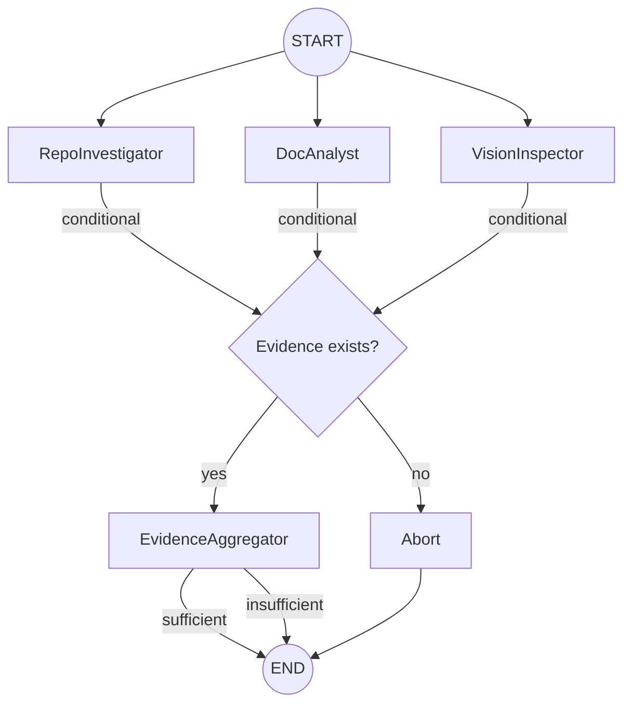

# Automaton Auditor

> **Orchestrating Deep LangGraph Swarms for Autonomous Governance.**

The Automaton Auditor is a production-grade multi-agent system designed to audit GitHub repositories and architectural reports. It uses a hierarchical swarm of specialized agents to verify code structure, analyze git history, and assess documentation depth.

## Architecture

The system uses a **Digital Courtroom** metaphor with three distinct layers:

1.  **Detective Layer (Current Implementation):** Forensic agents collect objective evidence from source code (AST parsing), git history (commit analysis), and PDF reports.
2.  **Judicial Layer (Phase 2):** Persona-based judges (Prosecutor, Defense, Tech Lead) analyze evidence to determine scores.
3.  **Supreme Court (Phase 2):** A Chief Justice node synthesizes final verdicts based on deterministic conflict resolution rules.



## Setup

### Prerequisites

- [uv](https://github.com/astral-sh/uv) (Python package manager)
- Google Gemini API Key ([get one here](https://aistudio.google.com/apikey))
- Git (for cloning target repositories)

### Installation

1.  Clone this repository:
    ```bash
    git clone https://github.com/Mistire/automaton-auditor.git
    cd automaton-auditor
    ```
2.  Install dependencies (exact versions locked in `uv.lock`):
    ```bash
    uv sync
    ```
3.  Configure environment variables:
    ```bash
    cp .env.example .env
    # Edit .env and add your GOOGLE_API_KEY (required)
    # LangSmith keys are optional but recommended for debugging
    ```

## Usage

Run the auditor against any GitHub repository URL and (optional) PDF report path:

```bash
uv run python main.py <GITHUB_REPO_URL> [PDF_REPORT_PATH]
```

### Examples

```bash
# Audit a repo without a PDF report
uv run python main.py https://github.com/user/their-repo

# Audit a repo with its accompanying PDF report
uv run python main.py https://github.com/user/their-repo reports/architecture.pdf

# Self-audit (run against your own repo)
uv run python main.py https://github.com/Mistire/automaton-auditor reports/interim_report.md
```

## Testing & Verification

### Quick Smoke Tests

Verify individual components work correctly:

```bash
# 1. State models import and validate correctly
uv run python -c "from src.state import Evidence, JudicialOpinion, AgentState; print('State Models: OK')"

# 2. Pydantic rejects invalid data (should raise ValidationError)
uv run python -c "
from src.state import JudicialOpinion
try:
    JudicialOpinion(judge='Bob', criterion_id='x', score=6, argument='', cited_evidence=[])
    print('ERROR: Should have raised ValidationError')
except Exception as e:
    print(f'Pydantic Validation: OK — caught: {type(e).__name__}')
"

# 3. StateGraph compiles without errors
uv run python -c "from src.graph import graph; print(f'Graph Compilation: OK — nodes: {list(graph.get_graph().nodes)}')"

# 4. Rubric JSON loads correctly
uv run python -c "
import json
with open('rubric/week2_rubric.json') as f:
    r = json.load(f)
print(f'Rubric: OK — {len(r[\"dimensions\"])} dimensions, {len(r[\"synthesis_rules\"])} rules')
"
```

### End-to-End Test

```bash
# Full detective run against a public repo
uv run python main.py https://github.com/Mistire/automaton-auditor
```

Expected output: structured evidence summary with ✅/❌ indicators per forensic finding.

## Project Structure

```
├── main.py                 ← Entry point: loads rubric, runs graph, prints results
├── pyproject.toml          ← Project manifest with locked dependencies
├── uv.lock                 ← Exact dependency versions (committed for reproducibility)
├── .env.example            ← Documented environment variable template
├── rubric/
│   └── week2_rubric.json   ← 10-dimension audit constitution (machine-readable)
├── reports/
│   └── interim_report.md   ← Architecture decisions and known gaps
├── src/
│   ├── state.py            ← Pydantic models (Evidence, JudicialOpinion, AgentState)
│   ├── graph.py            ← StateGraph with conditional edges and error handling
│   ├── tools/
│   │   ├── repo_tools.py   ← Sandboxed git clone, AST parsing, security scanning
│   │   └── doc_tools.py    ← PDF ingestion, path extraction, concept depth analysis
│   └── nodes/
│       └── detectives.py   ← Agent nodes: RepoInvestigator, DocAnalyst, EvidenceAggregator
└── audit/                  ← Output directories for generated audit reports
```

---
