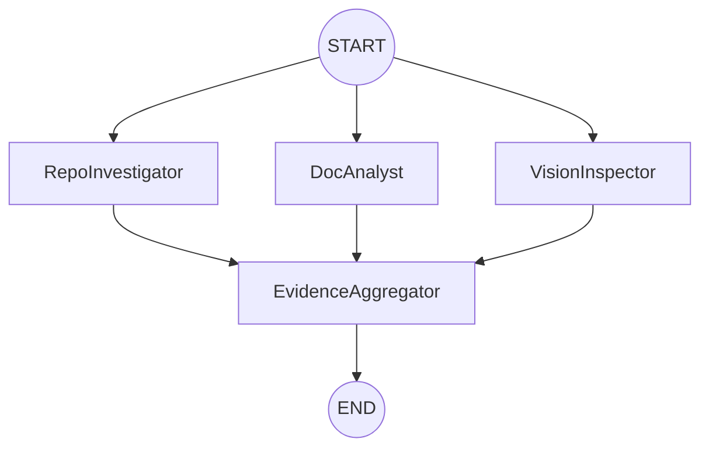

# Automaton Auditor

> **Orchestrating Deep LangGraph Swarms for Autonomous Governance.**

The Automaton Auditor is a production-grade multi-agent system designed to audit GitHub repositories and architectural reports. It uses a hierarchical swarm of specialized agents to verify code structure, analyze git history, and assess documentation depth.

## Architecture

The system uses a **Digital Courtroom** metaphor with three distinct layers:

1.  **Detective Layer (Current Implementation):** Forensic agents collect objective evidence from source code (AST parsing), git history (commit analysis), and PDF reports.
2.  **Judicial Layer (Phase 2):** Persona-based judges (Prosecutor, Defense, Tech Lead) analyze evidence to determine scores.
3.  **Supreme Court (Phase 2):** A Chief Justice node synthesizes final verdicts based on deterministic conflict resolution rules.



## Setup

### Prerequisites

- [uv](https://github.com/astral-sh/uv) (Python package manager)
- Google Gemini API Key

### Installation

1.  Clone this repository.
2.  Install dependencies:
    ```bash
    uv sync
    ```
3.  Configure environment:
    ```bash
    cp .env.example .env
    # Edit .env and add your GOOGLE_API_KEY
    ```

## Usage

Run the auditor against any GitHub repository URL and (optional) PDF report path:

```bash
uv run python main.py <GITHUB_REPO_URL> [PDF_REPORT_PATH]
```

Example:

```bash
uv run python main.py https://github.com/user/my-repo reports/architecture.pdf
```

## Project Structure

- `src/state.py`: Pydantic models and LangGraph `AgentState`.
- `src/graph.py`: StateGraph orchestration and wiring.
- `src/tools/`: Forensic tools (AST parsing, Git analysis, PDF ingestion).
- `src/nodes/`: Agent node implementations.
- `rubric/`: The 10-dimension JSON constitution.

---
