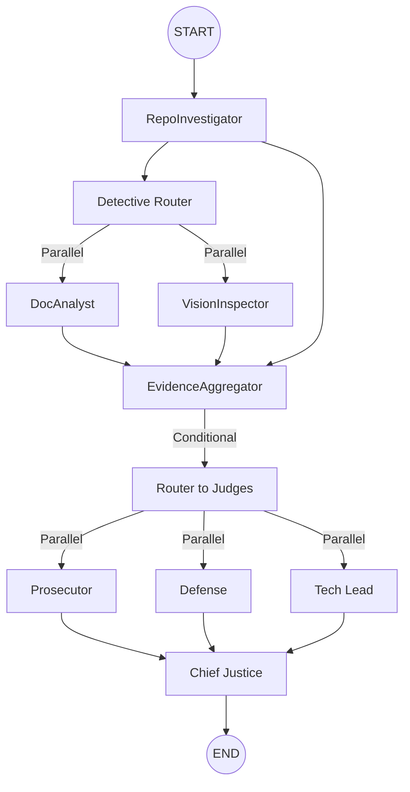

# Automaton Auditor

> **Orchestrating Deep LangGraph Swarms for Autonomous Governance.**

The Automaton Auditor is a production-grade multi-agent system designed to audit GitHub repositories and architectural reports. It uses a hierarchical swarm of specialized agents to verify code structure, analyze git history, and assess documentation depth through a dialectical judicial process.

## ⚖️ Key Features: 1-10 Standardized Governance

The system is recently updated to provide **100% Forensic Coverage** and a strict **1-10 scoring scale**:

- **AST-Level Forensics**: Specialized scanners for security, state management, judicial nuance, and synthesis logic.
- **Strict 1-10 Scale**: All judge personas and the final synthesis are unified on a 10-point scale for maximum clarity.
- **Multimodal Vision**: Architectural diagrams are extracted and verified against code using Gemini 2.0 Flash.
- **Deterministic Synthesis**: The Supreme Court engine (Justice) overrules LLM optimism with forensic facts (Security & Hallucination caps).

## Architecture: The Digital Courtroom

The system implements a **Hierarchical State Graph** with three specialized layers:

1.  **Detective Layer (Forensic Swarm):**
    - **RepoInvestigator:** Performs deep AST-based code forensics and identifies specialized tools.
    - **DocAnalyst:** Ingests PDF reports via Docling, verifies theoretical depth, and detects path hallucinations.
    - **VisionInspector:** Extracts diagrams via PyMuPDF and analyzes them via Gemini Vision.
2.  **Judicial Layer (Dialectical Bench):**
    - **Prosecutor**: Adversarial lens; hunts for security flaws and orchestration fraud.
    - **Defense**: Optimistic lens; highlights iterative effort and engineering intent.
    - **Tech Lead**: Pragmatic lens; evaluates technical debt and maintainability.
3.  **Supreme Court (Synthesis Engine):**
    - **Chief Justice**: Synthesizes a final verdict using **deterministic Python rules** (e.g., Security Override, Fact Supremacy).



## Setup

### Prerequisites

- [uv](https://github.com/astral-sh/uv) (Python package manager)
- Google Gemini API Key or OpenRouter API Key
- Git (for cloning target repositories)

### Installation

1.  Clone this repository:
    ```bash
    git clone https://github.com/Mistire/automaton-auditor.git
    cd automaton-auditor
    ```
2.  Install dependencies:
    ```bash
    uv sync
    ```
3.  Configure environment variables:
    ```bash
    cp .env.example .env
    # Edit .env and set your LLM_PROVIDER and API keys
    ```

## Usage

We provide a specialized `Makefile` and `audit.sh` wrapper for a better Developer Experience (DX).

### Commands

```bash
# Audit a specific peer repository
make audit URL=https://github.com/peer/week-2-repo

# Run a self-audit on the current workspace
make local

# Manual run via uv
uv run python main.py <GITHUB_REPO_URL>
```

## Output

- **Audit Reports**:
  - `audit/report_onself_generated/`: Results of auditing your own repo.
  - `audit/report_onpeer_generated/`: Results of auditing peer repositories.
- **Final Architecture Report**:
  - `reports/final_report.md`: A deep technical narrative of the system's design and optimization journey.

## Final Submission Requirements

Before submitting, ensure you have:

1. Pushed all changes to GitHub.
2. Generated an audit of your own repository (`make local`).
3. Generated an audit of your assigned peer's repository.
4. Committed all reports to the `audit/` folder.

---
