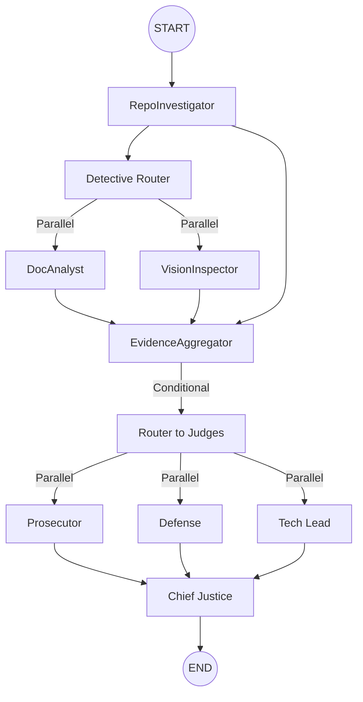

# Automaton Auditor

> **Orchestrating Deep LangGraph Swarms for Autonomous Governance.**

The Automaton Auditor is a production-grade multi-agent system designed to audit GitHub repositories and architectural reports. It uses a hierarchical swarm of specialized agents to verify code structure, analyze git history, and assess documentation depth through a dialectical judicial process.

## Architecture: The Digital Courtroom

The system implements a **Hierarchical State Graph** with three specialized layers:

1.  **Detective Layer (Forensic Swarm):**
    - **RepoInvestigator:** Performs deep AST-based code forensics and git history analysis.
    - **DocAnalyst:** Ingests PDF reports, verifies theoretical depth, and detects path hallucinations.
    - **VisionInspector:** Uses multimodal LLMs to analyze architectural diagrams.
2.  **Judicial Layer (Dialectical Bench):**
    - **Prosecutor**: Adversarial lens; hunts for security flaws and orchestration fraud.
    - **Defense**: Optimistic lens; highlights iterative effort and engineering intent.
    - **Tech Lead**: Pragmatic lens; evaluates technical debt and maintainability.
3.  **Supreme Court (Synthesis Engine):**
    - **Chief Justice**: Synthesizes a final verdict using **deterministic Python rules** (e.g., Security Override, Fact Supremacy).



## Setup

### Prerequisites

- [uv](https://github.com/astral-sh/uv) (Python package manager)
- Google Gemini API Key or OpenRouter API Key
- Git (for cloning target repositories)

### Installation

1.  Clone this repository:
    ```bash
    git clone https://github.com/Mistire/automaton-auditor.git
    cd automaton-auditor
    ```
2.  Install dependencies:
    ```bash
    uv sync
    ```
3.  Configure environment variables:
    ```bash
    cp .env.example .env
    # Edit .env and set your LLM_PROVIDER and API keys
    ```

## Usage

Run the auditor against any GitHub repository URL. The system will automatically discover the internal PDF report in the `reports/` folder.

```bash
uv run python main.py <GITHUB_REPO_URL>
```

### Examples

```bash
# Audit a specific peer repo
uv run python main.py https://github.com/peer/week-2-repo

# Self-audit
uv run python main.py https://github.com/Mistire/automaton-auditor
```

## Output

The- **Audit Reports**:

- `audit/report_onself_generated/`: Reports generated by this agent on its own repository.
- `audit/report_onpeer_generated/`: Reports generated by this agent on the peer's repository.
- `audit/report_bypeer_received/`: Reports received from the peer's agent.
  containing:

- **Executive Summary**: Overall verdict and percentage score.
- **Criterion Breakdown**: 10-dimension analysis with individual judge opinions and dissent summaries.
- **Remediation Plan**: Actionable, file-level instructions for improvement.

## Final Submission Requirements

Before submitting, ensure you have:

1. Pushed all changes to GitHub.
2. Generated an audit of your own repository.
3. Generated an audit of your assigned peer's repository.
4. Committed all reports to the `audit/` folder.

---
