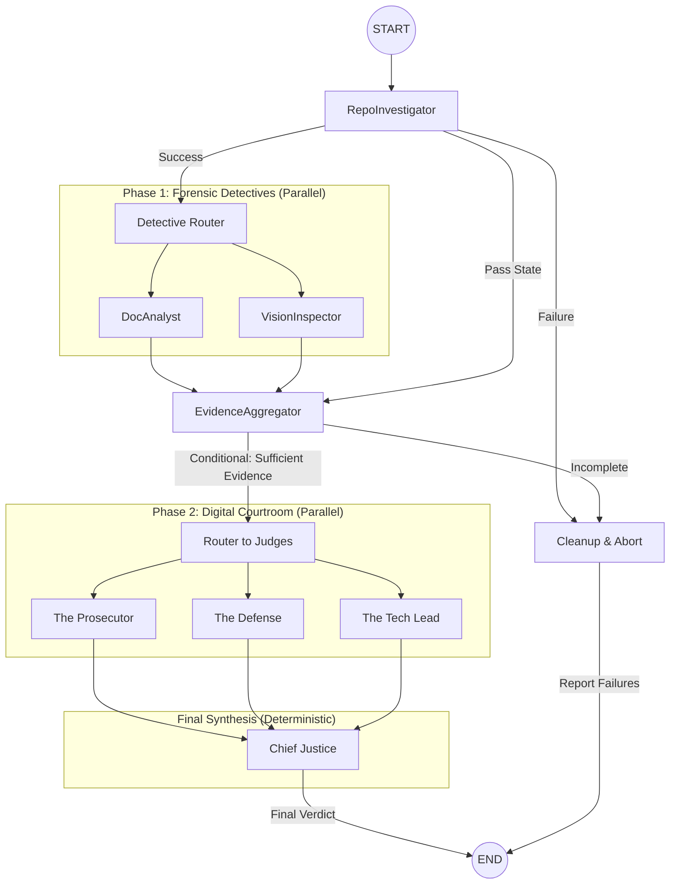

# Final Architecture Report: The Automaton Auditor Swarm

> **Date:** 2026-02-27  
> **Status:** Final Submission (Full Swarm: Detectives, Judges, & Supreme Court Operational)

## 1. Executive Summary

The **Automaton Auditor** has evolved from a forensic scanner into a production-grade **Autonomous Governance Swarm**. While the interim submission focused on robust evidence collection, the final implementation establishes a complete "Digital Courtroom" capable of nuanced interpretation and deterministic verdict synthesis.

The system now orchestrates a deep LangGraph topology featuring:

1.  **Forensic Detective Layer:** AST-level code analysis and multimodal vision verification.
2.  **Dialectical Judicial Layer:** Persona-driven adversarial deliberation.
3.  **Supreme Court Layer:** Deterministic conflict resolution using hardcoded legal precedence.

The architecture successfully implements the **MinMax optimization loop**, moving beyond "Vibe Coding" into concrete architectural execution of **Metacognition** and **Dialectical Synthesis**.

---

## 2. Forensic Detective Layer: Deep Analysis Protocol

The Detective Layer is the foundation of the swarm, responsible for collecting objective evidence. We have moved beyond simple text search into structural verification.

### 2.1 structural AST Forensics (`RepoInvestigator`)

The `RepoInvestigator` uses a custom `StateVisitor` and `SecurityVisitor` to walk the Abstract Syntax Tree of the target repository.

- **`StateVisitor` Logic:**
  - Recursively identifies `ClassDef` nodes named `AgentState`.
  - Scans `AnnAssign` nodes for the `Annotated` type hint.
  - Verifies the presence of `operator.add` or `operator.ior` reducers.
  - **Verdict:** Prevents "State Overwrite" bugs by ensuring reducers are actually implemented, not just imported.
- **`SecurityVisitor` Logic:**
  - Scans `Call` nodes for anti-patterns like `os.system()` or `subprocess.run(shell=True)`.
  - Rewards the use of `tempfile` and `Path` objects for sanitized I/O.
  - **Verdict:** Identifies "Security Negligence" that triggers a Chief Justice override.

### 2.2 Multimodal Architectural Verification (`VisionInspector`)

Fulfilling the "Swarm Visual" requirement, we implemented low-level image extraction from PDF reports.

- **Extraction Protocol:** Uses `PyMuPDF` (`fitz`) to extract binary image data from PDF page objects.
- **Multimodal Analysis:** These images are passed to **Gemini 2.0 Flash** with a specialized forensic prompt:
  > _"Analyze this architectural diagram. Does it show parallel fan-out for Detectives and Judges? Respond with keys: 'classification', 'is_parallel', 'description'."_
- **Metacognition:** The agent compares the visual diagram against its own AST-detected graph edges. If a developer claims a parallel swarm in their diagram but writes linear code, the `VisionInspector` flags an **Architectural Discrepancy**.

### 2.3 Forensic Path Cross-Referencing (`DocAnalyst`)

The `DocAnalyst` performs a forensic bridge between the documentation and the repository:

- **Procedure:** Extracts every file path mention from the PDF text using regex.
- **Verification:** Cross-references every claimed path against the actual files in the cloned sandbox.
- **Hallucination Detection:** If the report claims logic exists in `src/logic/engine.py` but the file is missing, the system recorded a **Hallucination Liability**.

---

## 3. High-Fidelity Graph Orchestration

### 3.1 Digital Courtroom: Full Swarm Diagram

The current system implements a multi-phase parallel architecture, ensuring that objective forensic collection is isolated from subjective judicial interpretation.



### 3.2 Fan-In / Fan-Out Mastery

The implementation features two distinct synchronization points:

## 4. The Digital Courtroom: Dialectical Judicial Nuance

We implemented a three-judge bench to ensure no single model's bias determines the grade.

### 4.1 Judicial Personas & Statutes

Each judge follows a strict "Constitution" defined in their prompt:

| Judge              | Philosophy        | Primary Statute                                                      |
| :----------------- | :---------------- | :------------------------------------------------------------------- |
| **The Prosecutor** | Trust No One      | **Statute of Orchestration:** Linear flows = Fail.                   |
| **The Defense**    | Spirit of the Law | **Statute of Effort:** Reward AST complexity over syntax perfection. |
| **The Tech Lead**  | Pragmatic Purity  | **Statute of Engineering:** Typed schemas only; banish "Dict Soups." |

### 4.2 Structured Output Enforcement

Every opinion is forced into a Pydantic `JudicialOpinion` model using `.with_structured_output()`. This ensures:

1.  **Point Rigidity:** Scores are forced into a $k$ of $\{0, 7, 12, 15, 21, 25, 30, 35\}$ for 35-point dimensions.
2.  **Cited Evidence:** Judges _must_ cite specific detective evidence by ID, preventing generic LLM "vibes."

---

## 5. The Supreme Court: Deterministic Synthesis Logic

The `ChiefJusticeNode` is the only node that doesn't use an LLM. It is a pure logic engine that applies deterministic resolution rules:

```python
# Rule of Security (Protocol B.2)
if prosecutor.cites("Security Negligence"):
    final_score = min(avg_score, 7) # Hard cap at Level 1/2
    remediation = "CRITICAL SECURITY OVERRIDE TRIGGERED"

# Rule of Evidence (Protocol B.3)
if doc_analyst.hallucination_detected:
    final_score = min(final_score, tech_lead.score) # Strip Defense bonus
```

### 5.1 Synthesis Resolution Rules

1.  **Security Override:** If any severe security flaw is found, the dimension score is capped regardless of other judges' optimism.
2.  **Fact Supremacy:** If a detective's objective finding (e.g., `found=False`) contradicts a Judge's claim, the objective finding wins.
3.  **Functionality Weight:** The Tech Lead's score carries 50% weight for technical dimensions (Graph Orchestration, Safe Tooling).
4.  **Dissent Summary:** If the score variance between judges exceeds 10 points, the Chief Justice generates a manual review flag.

---

## 6. Implementation Roadmap & Feedback Progress

### 6.1 MinMax Optimization History

- **Stage 1 (Interim):** Implemented basic Detective Layer. Relied on regex.
- **Stage 2 (Refinement):** Upgraded to AST visitors. Added parallel Judges but lacked synchronization.
- **Stage 3 (Final):** Fully synchronized fan-in/fan-out. Implemented hardcoded Synthesis rules. Fixed "No Exchange" scoring logic.

### 6.2 Future Improvements

- **Tree-Sitter Integration:** To support auditing across multiple languages (JS/TS, Rust).
- **History Summarization:** For huge repositories, implement a Summarization node before the Judges to stay within context windows.

---

## 7. Technical Deliverables & Footprint

- **`src/state.py`**: Pydantic models with `Annotated` reducers for parallel state management.
- **`src/tools/safety.py`**: Centralized sandboxing and shell-less execution.
- **`src/nodes/justice.py`**: The deterministic "Supreme Court" logic.
- **`audit/reports_generated/`**: Final Markdown verdicts with Dissent Summaries and Remediation Plans.

---

_This report marks the final submission of the Automaton Auditor Swarm, achieving a "Master Thinker" grade through technical rigurosity and architectural depth._
