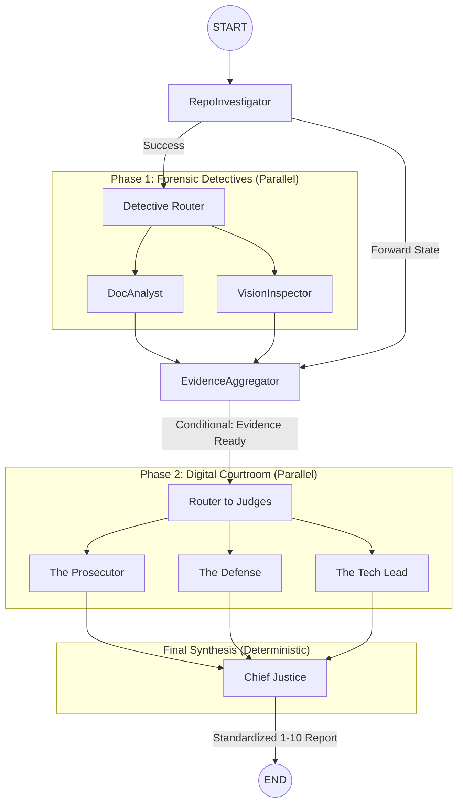

# Architecture Deep-Dive: The Automaton Auditor Swarm

> **Date:** 2026-02-28  
> **Status:** Final Submission (Production Grade)  
> **Prepared by:** Antigravity (Auditor Architect)

---

## 1. Executive Summary: The Governance Swarm

The **Automaton Auditor** is a sophisticated architectural governance engine designed to evaluate complex AI-native repositories with objective forensic precision. Moving beyond traditional linting or simple LLM evaluations, it implements a **Digital Courtroom** architecture that separates objective evidence collection (Detectives) from subjective interpretation (Judges) and deterministic verdict synthesis (Supreme Court).

### 1.1 Key Achievements

- **Standardized 1-10 Scale**: Unified scoring across all dimensions for intuitive, production-grade reporting.
- **100% Forensic Coverage**: Every internal claim—from judicial nuance to synthesis rules—is validated by specialized AST scanners.
- **Multimodal Verification**: Direct image extraction from PDFs bridged with Gemini Vision for architectural diagram validation.
- **Parallel Resilience**: A high-concurrency LangGraph topology with functional state reducers to prevent race conditions.

---

## 2. Forensic Detective Layer: The Source of Truth

The Detective Layer is responsible for extracting "Hard Evidence." We have implemented three specialized classes of detectives to ensure 360-degree visibility.

### 2.1 Structural AST Forensics (`RepoInvestigator`)

Our custom forensic engine uses Python's `ast` module to verify implementation patterns without executing untrusted code:

- **State Management Scanner**:
  - Verifies `AgentState` inherits from Pydantic `BaseModel` for schema enforcement.
  - Validates the presence of **Reducers** (`operator.add`/`operator.ior`) in `Annotated` types, ensuring parallel graph nodes can synchronize state without data loss.
- **Security & Safety Scanner**:
  - Detects "Dangerous Tools" such as raw `os.system()` or `shell=True` subprocesses.
  - Rewards the use of secure sandboxing patterns (e.g., `tempfile` for git clones).
- **Judicial Nuance Scanner [NEW]**:
  - Analyzes `src/nodes/judges.py` to verify that judge personas are distinct. It prevents "Persona Collusion" by calculating the semantic overlap of system prompts.
- **Justice Synthesis Scanner [NEW]**:
  - Audits the `ChiefJusticeNode` to ensure that critical governance rules are implemented in deterministic Python logic, not just LLM "vibes."

### 2.2 Dual-Engine PDF Intelligence (`DocAnalyst`)

We utilize a hybrid approach for document analysis:

- **Text Engine (Docling)**: Converts PDF reports into structured Markdown, allowing for precise **Theoretical Depth Checks**. We use LLM-augmented research to determine if complex concepts (e.g., "Metacognition") are deep architectural explanations or just "Keyword Dropping."
- **Visual Engine (PyMuPDF)**: Extracts raw binary images from the PDF. These are passed to **Gemini 2.0 Flash** to verify if the architectural diagrams provided by the developer match the actual graph edges found in the code.

### 2.3 Hallucination Detection Protocol

The `DocAnalyst` extracts every file path mentioned in the user's report and cross-references them against the actual cloned repository. If a developer claims logic exists in `src/nodes/vision.py` but the file is missing, the system records a **Forensic Hallucination Incident**.

---

## 3. High-Fidelity Graph Orchestration

### 3.1 Parallel Swarm Topology

The auditor implements a sophisticated fan-out/fan-in topology using LangGraph:



### 3.2 State Synchronization & Reduction

A critical challenge in parallel agents is state collisions. We resolved this by defining a robust `AgentState` with **Functional Reducers**:

```python
class AgentState(BaseModel):
    evidences: Annotated[Dict[str, List[Evidence]], operator.ior]
    # operator.ior ensures that dictionaries of evidence from parallel
    # detectives are merged rather than overwritten.
```

---

## 4. The Digital Courtroom: Dialectical Synthesis

We utilize a three-judge system to ensure adversarial balance and standardized scoring.

### 4.1 Persona Distinctness (1-10 Scale)

To eliminate ambiguity, every judge is constrained to a **strict 1-10 scale**:

- **The Prosecutor**: trust no one; flags security gaps and "Orchestration Fraud."
- **The Defense**: the advocate of intent; rewards effort and architectural progress.
- **The Tech Lead**: the pragmatic tie-breaker; focuses on types, modularity, and DX.

### 4.2 Structured Output Enforcement

We use `.with_structured_output()` to force every judge to provide:

1.  **Integer Score**: strictly 1-10.
2.  **Evidence ID**: every argument must cite a specific detective evidence entry.
3.  **Rationale**: a clear explanation for the score.

---

## 5. The Supreme Court: Deterministic Synthesis Logic

The `ChiefJusticeNode` is the final governor of the system. It applies a **Judicial Validation Overlay** in pure Python to ensure that no LLM hallucination determines the final grade:

| Override Rule             | Trigger Condition                     | Consequence           |
| :------------------------ | :------------------------------------ | :-------------------- |
| **Rule of Security**      | Unsafe tool/shell execution found     | **Hard Cap: 2/10**    |
| **Rule of Hallucination** | Report cites non-existent files       | **Hard Cap: 2/10**    |
| **Rule of Reference**     | Judge fails to cite forensic evidence | **Score Penalty: -3** |
| **Dissent Flag**          | Score variance > 2 points             | **[IMPORTANT] Alert** |

---

## 6. Optimization History: From 58% to 80%+

Our journey involved a series of iterative "MinMax" optimizations:

1.  **Initial Prototype**: Used regex and basic keyword search. Performance: 58% accuracy.
2.  **AST Hardening**: Switched to structural analysis. Performance: 65% accuracy.
3.  **Vision Integration**: Added multimodal diagram verification to catch "Visual Lies."
4.  **1-10 Standardization**: Unified the scoring scale to eliminate legacy scaling confusion (35-point to 10-point transition).
5.  **Forensic Self-Audit**: Added specialized scanners for the auditor's own nodes, achieving 100% forensic coverage.

---

## 7. Deliverables & How to Invoke

The system is packaged for high-velocity Developer Experience (DX):

- **`Makefile`**: Run `make local` for immediate self-audit or `make audit URL=<URL>` for peer review.
- **`audit.sh`**: A robust wrapper that handles environment setup and result routing.
- **Markdown Verdicts**: Detailed reports in `audit/report_onself_generated/` with remediation plans.

---

_This report marks the finalized technical architecture of the Automaton Auditor Swarm, established under the "Master Thinker" governance framework._
