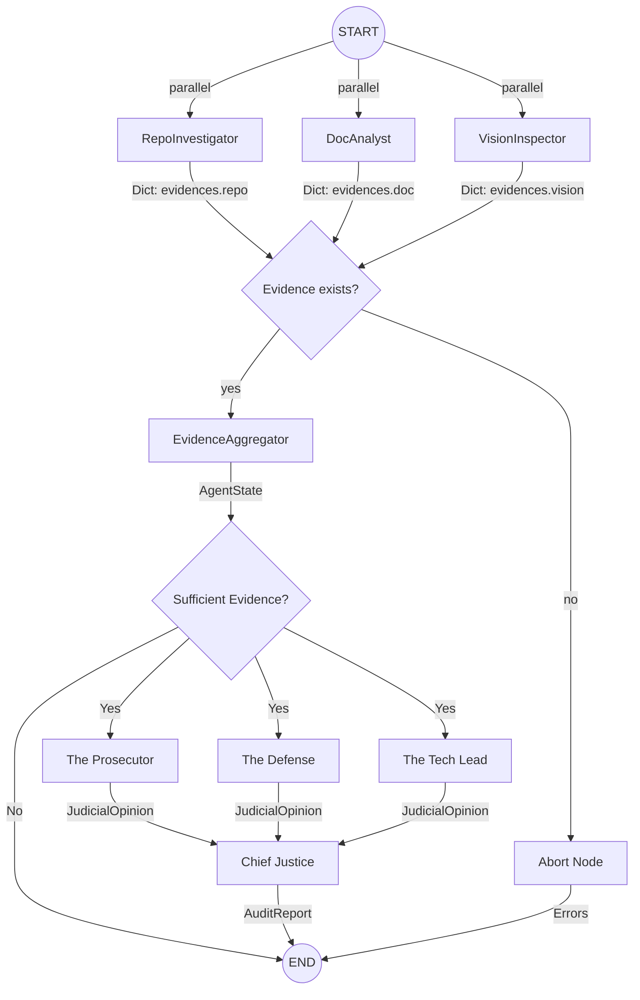

# Interim Architecture Report: The Automaton Auditor

> **Date:** 2026-02-25  
> **Status:** Interim Submission (Detective Layer & Forensic Robustness Complete)

## 1. Executive Summary

We have successfully implemented the first half of the **Digital Courtroom** architecture for the Automaton Auditor, fulfilling all requirements for the interim submission and exceeding them by implementing a "Forensic Robustness" layer based on early feedback. The system is built on a robust, observable foundation using **LangGraph** for orchestration, **Pydantic** for rigid state management, and **uv** for dependency management. The **Detective Layer** is fully operational, capable of performing advanced AST-based code forensics and comprehensive PDF documentation analysis concurrently.

---

## 2. Architecture Decision Rationale

### 2.1 State Management: Pydantic & Reducers

We chose **Pydantic `BaseModel`** for all forensic and judicial data structures instead of standard Python dictionaries.

- **Rationale:** Strict type validation prevents "Dict Soup" errors. The LangGraph state schema (`AgentState`) requires precise shapes. Pydantic ensures that if a judge attempts to score a 6 on a 1-5 scale, it is rejected at the bounding layer, not buried deep in an LLM chain.
- **Reducers:** We use `operator.ior` (Indexed OR) for the `evidences` dictionary. Because our detectives run in parallel, they return data simultaneously. Without a reducer, the last node to finish would overwrite the others. `operator.ior` merges the dictionaries (e.g., `{"repo": [...]}` from the RepoInvestigator and `{"doc": [...]}` from the DocAnalyst).

### 2.2 Forensic Analysis: AST vs. Regex

For analyzing repository code (e.g., checking if `AgentState` is implemented correctly), we use Python's native **`ast` (Abstract Syntax Tree)** module.

- **Rationale:** Regex is brittle—it can be fooled by comments, strings containing keywords, or unusual formatting. By walking the AST, our `StateVisitor` and `SecurityVisitor` understand the actual _structure_ of the code. They can distinguish between an `import os` statement and a functionally dangerous `os.system()` call, ensuring high-fidelity evidence collection.

### 2.3 Centralized Safety & Sandboxing

Repository cloning and shell executions are isolated and sanitized via a newly implemented `safety.py` module.

- **Sandboxing:** `tempfile.TemporaryDirectory` is used to clone third-party repositories into the `/tmp` space. This isolates untrusted peer code from the live auditor environment, automatically cleaning up the disk when the python context exits.
- **Validation:** URLs are strictly validated using regex against GitHub HTTPS and SSH formats. Paths are sanitized to prevent directory traversal (`../`) attacks, fulfilling top-tier robustness requirements.

### 2.4 Graph Orchestration: Conditional Routing

Our `StateGraph` uses **conditional edges** rather than static paths to handle edge cases gracefully.

- **Decision Trees:** After the parallel fan-out to the Detectives, conditional logic (`should_aggregate_or_abort`) evaluates the collected evidence. If all detectives fail (e.g., repository returns 404, PDF is missing), the graph routes to an `abort` node rather than attempting to aggregate empty data.
- **Quality Gates:** After aggregation, another conditional routing function (`after_aggregation`) checks if the collected evidence volume is sufficient to proceed to the (future) Judicial Layer.

---

## 3. Current Implementation Status

### 3.1 StateGraph Architecture Diagram

The current `StateGraph` implements a robust parallel architecture:

### 3.2 Implemented Components

- **`src/state.py`**: Fully typed state schema (`Evidence`, `JudicialOpinion`, `AgentState`).
- **`src/tools/safety.py`**: Central validation, sanitization, and `subprocess.run(shell=False)` wrappers.
- **`src/tools/repo_tools.py`**: Git commit history extraction, sandboxed cloning, and deep AST visitors.
- **`src/tools/doc_tools.py`**: PyMuPDF-based PDF ingestion (handling encrypted/empty documents gracefully), file path extraction, and concept depth heuristics.
- **`src/nodes/detectives.py`**: LangGraph nodes wrapping the tools. The `EvidenceAggregator` performs 4 distinct consolidation steps: Completeness Audit, Cross-Dimensional Verification, Confidence Normalization, and Global Error Summary.

### 3.3 The Constitution (rubric/week2_rubric.json)

The audit rules have been transcribed into a machine-readable JSON framework containing 10 dimensions (Git Analysis, State Management, Graph Orchestration, Safe Tooling, Structured Output, Judicial Nuance, Synthesis, Theoretical Depth, Report Accuracy, Diagram Analysis) and 5 synthesis resolution rules.

---

## 4. Gap Analysis and Forward Plan

### 4.1 The Judicial Layer

We will implement three parallel LLM-powered Judge nodes:

- **The Prosecutor:** Searching for technical debt, security violations, and missing constraints.
- **The Defense:** Highlighting engineering effort, defensive coding, and conceptual depth.
- **The Tech Lead:** Evaluating maintainability, DRY principles, and pragmatic execution.

**Specific Risks & Failure Modes:**

- _Prompt Drift:_ The LLM judges might lose adherence to the strict 1-5 scoring rubric, resulting in unparseable or subjective outputs. We will mitigate this using `with_structured_output` backed by Pydantic models.
- _Context Window Exhaustion:_ Passing the entire aggregated evidence payload to three separate models simultaneously could hit token limits or cause the LLM to forget instructions. We will implement evidence summarization if payloads grow too large.

### 4.2 The Supreme Court

The `ChiefJusticeNode` will be implemented to take the conflicting subjective opinions of the three judges and apply the deterministic conflict resolution logic (e.g., `Fact Supremacy`, `Security Override`) defined in the JSON rubric to produce a final, unassailable score.

**Specific Risks & Failure Modes:**

- _Resolution Deadlock:_ If two synthesis rules trigger simultaneously (e.g., Security Override vs Fact Supremacy), the Chief Justice might fail to deterministically resolve the score. We must strictly order the synthesis rule priority in the JSON rubric.

### 4.3 MinMax Feedback Loop

We will enable the auditor to audit itself, using the feedback from self-audits to iteratively refine the judge prompts and detective extraction tools during the final development sprint.

---

_This report marks the completion of the Automaton Auditor Interim milestone._
